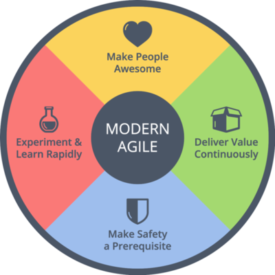
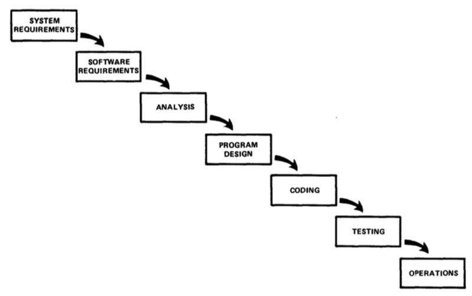
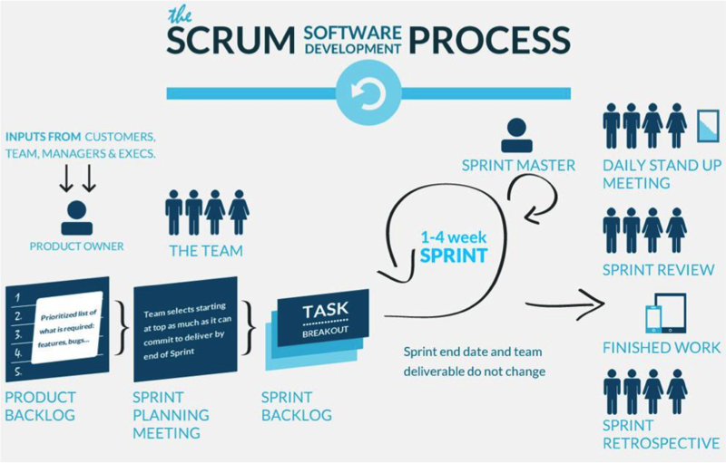
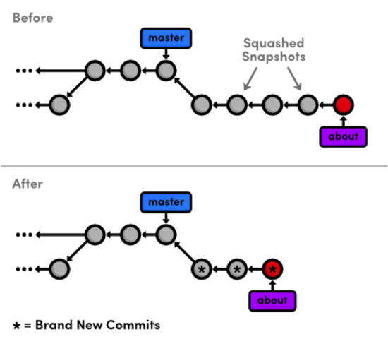
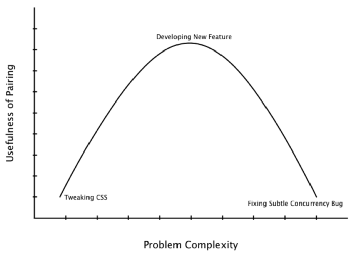
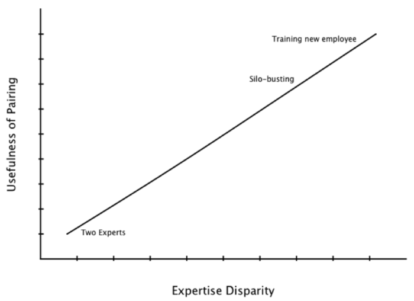

class: center, middle

# {{page.title}}

## CS291A: Scalable Internet Services

### Dr. Bryce Boe

---

# Today's Agenda

* Agile Software Development

* Test Driven Development

* Continuous Integration

* Github Workflow

* Pair Programming

---

class: center inverse middle

# Agile Software Development

---

# Talent Shortage


Source:
https://techcrunch.com/2013/05/05/there-is-in-fact-a-tech-talent-shortage-and-there-always-will-be/

---

# Talent Shortage

> Technology is no longer just driving tech companies — it is such an economic
force that it has a hand in how nearly every other sector grows.

> All Industries Become Tech Industries.

> Since 2010, the number of tech-related jobs in the U.S. has increased by
around 200,000 every year, and the U.S. economy is becoming increasingly
reliant on tech labor for its survival.


Source:
https://readwrite.com/2019/07/04/today-the-tech-talent-shortage-is-everybodys-problem/

---

# Scarce Resources

Software Engineering requires judicious use of scarce resources.

__You__ are one of those scarce resources.

Modern techniques are designed to optimize for your time.

## Modern Software Development Techniques

* Agile and Scrum

* Test Driven Development (TDD)

* Continuous Integration (CI)

* Github work flow

* Pair programming (pairing)

---

# Understanding Agile

> ## Sprint 2: Starts October 12

> * Conduct a __retrospective__ on how the last sprint went and how your group
>   can improve.

> * Decide on a sprint commitment.

> * Implement stories from the current sprint.

Soon guidelines like the above should make complete sense to you.

---

# Agile and Scrum

.left-column[
  > What is Agile software development?

  __Agile__ is a collection of different approaches for developing software
    that has emerged as dominant over the last 15+ years.

  __Scrum__ is a popular form of Agile software development.
]

.right-column.center[
  

  [Modern Agile](http://modernagile.org/)
]

---

class: center inverse middle

# The World Before Agile

---

# Waterfall

The origin of the _Waterfall_ model is generally misattributed to Winston
Royce, from his paper: "Managing the Development of Large Software Systems"

In reality, he wasn't the first, and didn't advocate for what became Waterfall
software engineering.

Herbert Benington would be a more accurate attribution.

Reference: *1970, Proceedings of IEEE WESCON 26 (August): 1–9.

---

# Waterfall Diagram

.center[]

This diagram from Royce's paper is frequently cited.


---

# Waterfall Process

Each stage performs its role and then passes its deliverable to the next stage.

E.g., Design must be completed before coding, which in-turn must be completed
before testing.

Strength: This approach allows for deep specialization.

Waterfall works great for areas like manufacturing where it is _expensive_ to
alter the design due to issues detected in latter stages.

With software it's incredibly cheap to adapt the process along the way.

---

# Waterfall Continued

The Waterfall technique works best when you have complete knowledge. With
respect to software development:

* Software testers and developers know everything about how the software will
  be deployed

* Software developers have few if any _surprises_ during testing

* Designers have complete understanding of the difficulty of each design
  decision

* Requirements team understands the impact on design and development

In practice most of these items are not met, thus the waterfall model inhibits
the software development process.

---

# Agile Manifesto

In 2001, the “Agile Software Manifesto” was written by Kent Beck, Ken Schwaber,
Jeff Sutherland, and Dave Thomas.

## Agile Values

* __Individuals and interactions__ over processes and tools

* __Working software__ over comprehensive documentation

* __Customer collaboration__ over contract negotiation

* __Responding to change__ over following a plan

---

# Individuals and Interactions

... over processes and tools

.center[]

---

# Working Software

... over comprehensive documentation

## Agile

* Focus on deliverable features
* Automated acceptance, unit, functional, and integration tests

## Waterfall

* Extensive documented requirements (before any prototype)
    * Style guide
    * Commenting rules
    * Component interaction
    * User interface requirements

---

# Customer Collaboration

... over contract negotiation

.left-column.center[
  

  "Here's what we've got so far."

  "That's great, but it doesn't quite fit my workflow."

  "No problem, what's your workflow so we can suit your needs."
]

.right-column.center[
  

  "I'm sure if I just build what they've asked for, they'll love it."
]

---

# Tree Swing Cartoon

.center[]

---

# Responding to Change

... over following a plan

* Unexpected issues will occur during the product development.

* Responding to change involves deciding how to best proceed when such issues
  occur.

For example:

> What do you do when half your team is suddenly out sick?

--

> What do you do when a simple feature addition turns out to be
> significantly more complicated?

---

# Scrum

Scrum is a specific type of Agile software development.

It was developed in the early 1990s by Ken Schwaber and Jeff Sutherland.

Consider using a simplified version of Scrum for project 3 and the primary project.

## Other Agile Alternatives

* __Kanban__: Focus on controlling WIP (work in progress), no __sprints__

* Extreme Programming (XP): Emphasis on feedback systems through automated
  testing and pair programming


---

# Scrum Roles

## Product Owner

Understands the needs of the customer and prioritizes those needs.

## The Team

Comprised of people building the software. Individual roles are intentionally
vague.

## Scrum Master

Responsible for making sure the _Scrum_ process is followed and helps to
resolve blocking issues (e.g., between members of the team, with the product
owner, or with external dependencies)


---

# Scrum User Story Defined

A __story__ is a unit of functionality that exposes something new to the user
(customer). Stories are often written like:

> As a \_\_\_\_\_\_\_\_\_\_, I can \_\_\_\_\_\_\_\_\_\_, in order to
> \_\_\_\_\_\_\_\_\_\_.

For example:

> As a github gold organization, I am permitted up to 50 private repositories,
> in order to securely maintain a large number of distinct projects.

> As an authenticated student user, I am able to post a question such that my
> instructor knows I am asking the question but my classmates do not, in order
> to ask a question my peers might not appreciate.

---

# Scrum Sprint Defined

A __sprint__ is a specific length of time to accomplish some work.

Sprints may operate on the same schedule as product releases (e.g., 2-week
Sprints immediately followed by releasing whatever was accomplished) however,
it's not necessary.

---

# Scrum Process



---

# Scrum Process

At the start of each sprint is the __sprint planning meeting__ to decide the
"sprint commitment".

Stories are pulled from the prioritized product backlog into the sprint
backlog. The team may decide to pull stories in a slightly different order
depending on various constraints. So _agile_.

The team decides how many stories to pull based on their prior estimate of
those stories' effort (done in _grooming_) relative to their current
_velocity_. Velocity is often the average amount of _work_ delivered over the
last three weeks.

After the sprint planning meeting the commitment is _frozen_ and the team works
through the sprint backlog for the duration of the sprint.

Each day the team has a __stand up__ meeting to discuss what is currently being
worked on, and to discover any _blocking_ issues.

---

# End of Sprint

A __sprint review__ is conducted at the end of the sprint to demo what was
accomplished. Everything considered completed should be ready to be released to
customers (also referred to as __shippable__).

Finally a __sprint retrospective__ is conducted for the team to reflect on how
well or poorly things went during the sprint. The team discusses how they can
improve their process and (hopefully) comes out of the meeting with concrete
ideas to be acted upon in the next sprint.

---

# CS291 Simplified Scrum (Optional)

- No product owner

- No scrum master

- Once per week:

  - Conduct a brief retrospective

  - Determine commitment for the next sprint

- During Team Demo Time

  - Demo your sprint (last week's worth of) progress to me


---


# Test Driven Development

Assume we have a large group of software engineers working on the same project.

Every day, each engineer makes many changes to the project.

Human error is common and information is not global.

Errors will happen.

--

> How do we discover when errors occur?

---

# Discovering Errors

* Humans can be used to check for defects, but this is expensive.

* Type systems and compilers work well to statically check for defects, but can
  only discover certain classes of errors.
    * Formal verification tools exist, but are not widely used in industry.

* Automated testing

---

# Automated testing...

* ... is writing testing code to execute your production code and make
  assertions about how it should behave.

* ... can be measured by code coverage tools that determine which code paths
  are executed by your tests.

* ... allows you to build large and complex systems with very permissive
  languages.

    * For a dynamically typed language like Ruby, automated testing can make up
      for the lack of static checks normally done by a compiler.

---

# Automated Testing: How?

__If automated testing is important and we want significant code coverage (not
necessarily 100%), how do we get there?__

* Don't write any production code, until there is test code that tests the
  desired functionality.

* Write the minimal amount of production code to make the test(s) pass.

--

## Steps

1. (__RED__) Write the simplest test case to observe a failure -- actually
observe it!

2. (__GREEN__) Write the least amount of code to observe the test pass.

3. (__REFACTOR__) Clean up your design of both the code and tests.

---

# TDD Example: FizzBuzz

* If the argument is divisible by three, return "Fizz"

* If the argument is divisible by five, return "Buzz"

* If the argument is divisible by both return "FizzBuzz"

* Otherwise return the argument

---

# Test Fizz (red)

## Test

```ruby
def test_divisible_by_3
  assert_equal 'Fizz', fizzbuzz(3)
end
```

--

## Program

```ruby
def fizzbuzz(n)
  # test_divisible_by_3 fails
end
```

---

# Test Fizz (green)

## Test

```ruby
def test_divisible_by_3
  assert_equal 'Fizz', fizzbuzz(3)
end
```

## Program

```ruby
def fizzbuzz(n)
  'Fizz'
  # test_divisible_by_3 passes
end
```

---

# Test Buzz (red)

## Test

```ruby
def test_divisible_by_5
  assert_equal 'Buzz', fizzbuzz(5)
end
```

--

## Program

```ruby
def fizzbuzz(n)
  'Fizz'
  # test_divisible_by_3 passes
  # test_divisible_by_5 fails
end
```

---

# Test Buzz (green)

## Test

```ruby
def test_divisible_by_5
  assert_equal 'Buzz', fizzbuzz(5)
end
```

## Program

```ruby
def fizzbuzz(n)
  if n % 3 == 0
    'Fizz'
  else
    'Buzz'
  end
  # test_divisible_by_3 passes
  # test_divisible_by_5 passes
end
```

---

# Test FizzBuzz (red)

## Test

```ruby
def test_divisible_by_both
  assert_equal 'FizzBuzz', fizzbuzz(15)
end
```

--

## Program

```ruby
def fizzbuzz(n)
  if n % 3 == 0
    'Fizz'
  else
    'Buzz'
  end
  # test_divisible_by_3 passes
  # test_divisible_by_5 passes
  # test_divisible_by_both fails
end
```

---

# Test FizzBuzz (green)

## Test

```ruby
def test_divisible_by_both
  assert_equal 'FizzBuzz', fizzbuzz(15)
end
```

## Program

```ruby
def fizzbuzz(n)
  if n % 3 == 0
    if n % 5 == 0
      'FizzBuzz'
    else
      'Fizz'
    end
  else
    'Buzz'
  end
  # test_divisible_by_3 passes
  # test_divisible_by_5 passes
  # test_divisible_by_both passes
end
```

---

# Test Other (red)

## Test

```ruby
def test_divisible_by_neither
  assert_equal 17, fizzbuzz(17)
end
```

--

## Program

```ruby
def fizzbuzz(n)
  if n % 3 == 0
    if n % 5 == 0
      'FizzBuzz'
    else
      'Fizz'
    end
  else
    'Buzz'
  end
  # test_divisible_by_3 passes
  # test_divisible_by_5 passes
  # test_divisible_by_both passes
  # test_divisible_by_neither fails
end
```

---

# Test Other (green)

## Program

```ruby
def fizzbuzz(n)
  if n % 3 == 0
    if n % 5 == 0
      'FizzBuzz'
    else
      'Fizz'
    end
  elsif n % 5 == 0
    'Buzz'
  else
    n
  end
  # test_divisible_by_3 passes
  # test_divisible_by_5 passes
  # test_divisible_by_both passes
  # test_divisible_by_neither passes
end
```

---

# FizzBuzz Refactor

## Program

```ruby
def fizzbuzz(n)
  if n % 15 == 0
    'FizzBuzz'
  elsif n % 3 == 0
    'Fizz'
  elsif n % 5 == 0
    'Buzz'
  else
    n
  end
  # test_divisible_by_3 passes
  # test_divisible_by_5 passes
  # test_divisible_by_both passes
  # test_divisible_by_neither passes
end
```

---

# Types of Tests

The previous FizzBuzz example demonstrated __unit__ tests. Other types of tests
are:

* Functional

* Integration

* System

* Acceptance

Whenever you discover a bug, the first thing you _should_ do is write a test
that demonstrates the failure caused by the bug. Then fix the code and observe
it passing. Building this set of tests helps prevent the introduction of a
_regression_.

---

# Testing Pyramid

.center[]

There should be signficantly more unit tests than higher-level tests.

Source: https://martinfowler.com/bliki/TestPyramid.html

---

# TDD Encouragement

When working on your projects I strongly recommend that you begin by trying out
test driven development.

High test coverage can help you avoid getting stuck on bugs, which is even more
important as more people are working on the same code.

Your grade does not depend on your code coverage, however, significant code
coverage will help to ensure a bug is not introduced prior to your team's
presentation (that would impact your grade). It should also help reduce the
time to __integrate__ feature branch changes.

---

# Integration

Taking independently developed changes and reconciling their conflicts.

Integration can be very difficult and painful.

> Should we perform integration as rarely as possible or as frequently as
> possible?

---

# Martin Fowler

.left-column40[
.center[


Chief Scientist, ThoughtWorks
]
]
.right-column60[

> The effort of integration is exponentially proportional to the amount of time
between integrations.]

---

# Reconcile Early and Often

If we never let our changes diverge too much from the rest of the group,
reconciling our changes will never be too hard.

__Conclusion__: commit early and often, and merge others' changes early and
often

> How do we ensure we have successfully reconciled?

---

# Continuous Integration

__Automated Tests!__

Utilize a __Continuous Integration__ server (CI) that will monitor changes to
your source code.

Whenever anyone checks in new code, run all the tests.

* The sooner you find and fix integration problems, the better.

* This also prevents defects unrelated to integration.

The CI server can also test code quality and security, among other things.

---

# CI via GitHub Actions

.center[]

---

# GitHub Actions

You will configure your primary project to use [GitHub Actions](https://github.com/features/actions)

Consider using GitHub Actions for Project 3 too.

GitHub actions is free for open-source projects.

If you are doing TDD and creating automated tests, GitHub Actions will provide you
with immediate feedback on your changes through GitHub:

.center[]

---

# Other Related Tools

## Coveralls

Web service that provides view into code coverage that occurs during the
testing phase. Integrates with GitHub and can be configured to
_fail_ pull requests that decrease code coverage.

https://coveralls.io/

Free for open source projects.

## Rubocop

A static analysis tool for ruby that suggests source code improvements
encompassing code style, unused variables, visually ambiguous statements, and
more.

https://github.com/bbatsov/rubocop

---

# Workflow

We know that we do not want our changes to diverge too far from the rest of
the group.

> What's the right way to use our source control system to accomplish this
> goal?

There are two popular git-based workflow systems:

* [Git-flow](http://nvie.com/posts/a-successful-git-branching-model/)

* [GitHub Flow](https://guides.github.com/introduction/flow/)

GitHub Flow is simpler and recommended for this class.

---

# GitHub Flow

1. Ensure your main branch is up-to-date with the remote (often called
   `origin`)

2. Create a new branch for your feature (often called a `feature branch`)

3. Make regular
   [atomic commits](https://www.freshconsulting.com/atomic-commits/) to the
   feature branch

4. Regularly push your local changes to the remote branch on github

5. Open a github pull request when the work on the feature branch is complete, or when you want feedback

6. Have a group member perform a _code review_ of your changes

7. If there are issues to address from _code review_, resolve them

8. If there are test failures (you've set up a CI system, right?) fix them

9. Merge the branch to main when everything is good-to-go

__Note__: We neglected the _deploy_ phase just prior to merging.

---

# GitHub Flow Commands

## Ensure your main branch is up-to-date with the remote

```bash
git pull
```

## Create a new branch for your feature

```bash
git checkout -b feature_name
```

## Commit to the feature branch regularly

```bash
git add [files...]
git commit -m "Add a brief useful description of changes"
```

## Push local changes to the remote

``` bash
git push -u origin HEAD
```

---

# Integration with Git

Recall what we want to reconcile our changes regularly. Feature branches should
be no more than a day or two out-of-sync with their parent branch.

If you want to reconcile your changes without merging to main, a __git
rebase__ is very useful:

```bash
git rebase main feature_branch
```

.center[]

---

# Git Interactive Rebase

.left-column40[
If you have been committing frequently and want to squash some commits,
consider an interactive rebase:

```bash
git rebase -i main
```
]
.right-column60[
.center[]
]

---

# Pair Programming

.left-column[
.center[]

Two developers share one computer and discuss all code that is being written.
]
.right-column[
### Driver-Navigator

One person does most of the implementation while the other watches, discusses,
thinks of consequences, and looks forward.

### Ping-pong pairing

One person writes the test, the other makes it pass. This approach is
frequently used while learning TDD and pair programming.

In both approaches, pairs should regularly switch roles (e.g., every twenty
minutes).
]

---

# Pairing: Problem Complexity

.center[]

Source: Dr. Andrew Mutz

---

# Pairing: Expertise Disparity

.center[]

Source: Dr. Andrew Mutz

---

# Pairing: Code Reading

.center[]

Source: Dr. Andrew Mutz

---

# Pairing in this class

Pair programming is __strongly__ encouraged, but not required.

When you pair you will inevitably experience more of your project. This means
you can claim you worked on that component in an interview, and as a result
should be able to sufficiently explain what was done.

On the other hand, it is possible for there to be bad pairings among your
group. If you don't feel it is working out, then simply don't do it.

---

# Mob Programming (aka Mobbing)

Like pair programming, but involving 3+ people.

- <https://www.agilealliance.org/resources/sessions/mob-programming-aatc2017/>
- <https://www.remotemobprogramming.org/>
